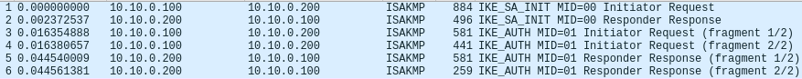
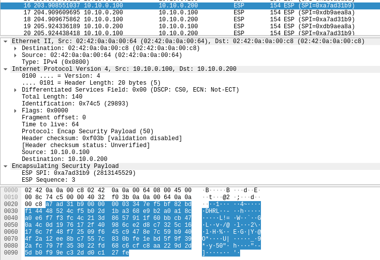

# ipsec-docker
Repo contains example of configuring host-to-host ipsec tunnel between two Docker containers.  
My work is based on [hwdsl2/docker-ipsec-vpn-server](https://github.com/hwdsl2/docker-ipsec-vpn-server) repo. Go check it out!

### Prequisities
[Install docker-compose](https://docs.docker.com/compose/install/)
[Install libre-swan](https://libreswan.org/)
[Read libre-swan docs :)](https://libreswan.org/wiki/Host_to_host_VPN)

### Usage scenario

#### Generate RSA keys and create tunnel configuration
```shell
$ ./generate-config.sh
```
Script creates directory with tunnel configurations for each container.

#### Build image
```shell
$ ./build/create-image.sh
```

#### Load necessary kernel modules
```shell
$ ./build/load-modules.sh
```

#### Start containers in detached mode
```shell
$ sudo docker-compose up -d
```

#### Log into containers and run ipsec commands
```shell
# West container terminal, log into container
$ sudo docker-compose exec west bash
# Run pluto - IKE daemon
$ bash-5.1# ipsec pluto
/usr/local/libexec/ipsec/pluto: pluto: warning: chdir("/run/pluto") to dumpdir failed (2: No such file or directory)
# Now run the same in the east container, then proceed with the rest
$ bash-5.1# ipsec auto --add mytunnel
002 "mytunnel": terminating SAs using this connection
002 "mytunnel" #1: deleting state (STATE_V2_PARENT_I1) aged 26.967386s and NOT sending notification
002 "mytunnel": added IKEv2 connection
$ bash-5.1# ipsec auto --up mytunnel
002 "mytunnel" #6: initiating Child SA using IKE SA #4
189 "mytunnel" #6: sent CREATE_CHILD_SA request for new IPsec SA
004 "mytunnel" #6: initiator established Child SA using #4; IPsec tunnel [10.10.0.100-10.10.0.100:0-65535 0] -> [10.10.0.200-10.10.0.200:0-65535 0] {ESP/ESN=>0xec3051ca <0x9d514a31 xfrm=AES_GCM_16_256-NONE-MODP2048 DPD=passive}
# Tunnel configured successfully
$ bash-5.1# ipsec trafficstatus
006 #5: "mytunnel", type=ESP, add_time=1667933454, inBytes=0, outBytes=0, maxBytes=2^63B, id='@east.kti.pg.pl'
006 #6: "mytunnel", type=ESP, add_time=0, inBytes=0, outBytes=0, maxBytes=2^63B, id='@east.kti.pg.pl'

```
```shell
# East container terminal, log into container
$ sudo docker-compose exec east bash
# Run pluto - IKE daemon
$ bash-5.1# ipsec pluto
/usr/local/libexec/ipsec/pluto: pluto: warning: chdir("/run/pluto") to dumpdir failed (2: No such file or directory)
```

#### Results
Once you run all of the commands you can see what IPSec tunnel looks like from the outside with wireshark.

IKE negotiations

ICMP packet modified into ESP packet - ping the container once tunnel is configured.  
Data is encrypted. Security Parameters Index and Sequence Number are present.
